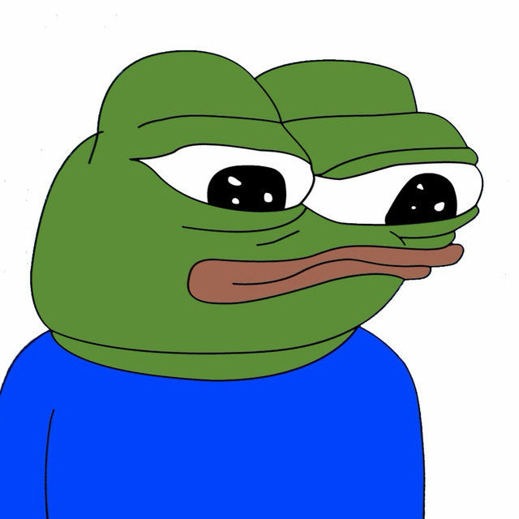
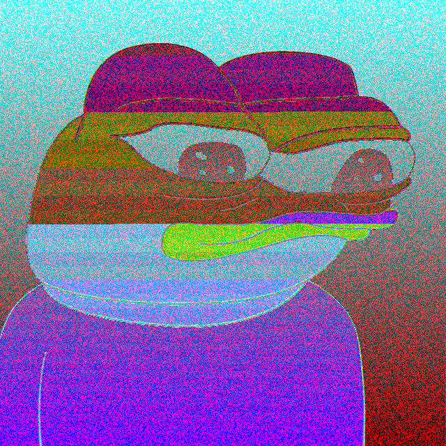
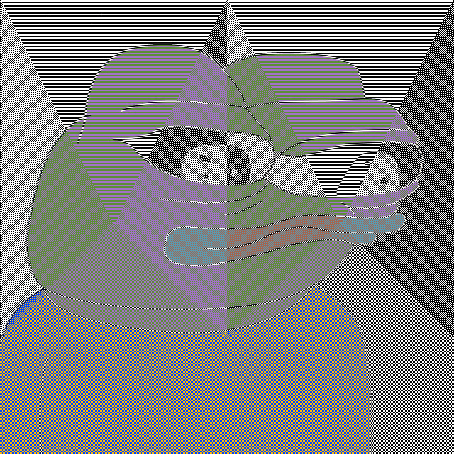

# 🎨 Painting with Ransomware

**Painting with Ransomware** is a cryptography-art tool that explores how encryption, especially flawed or stylistically unusual implementations, can be used to create compelling visuals from images. Inspired by real ransomware behaviors, encryption block modes, and cellular automata, this tool transforms input images into glitchy, pixel-based artwork using repeatable, deterministic, and visually distinct encryption methods.

> ⚠️ This project is designed **for research, education, and artistic expression**. It is not meant to be used for malicious purposes. Please also note that this is a work in progress, and this is not fully representative of what the final project will look like.

---

## How It Works

The tool takes an input image and applies a chosen "ransomware-inspired" encryption scheme. Some schemes are based on real-world malware (e.g. LooCipher, Prince Ransomware), while others are conceptual or playful (e.g. cellular automata masks, Mersenne Twister keystreams, stretched RC4 KSA).

Each scheme creates distinctive artifacts in the encrypted image, making the cryptographic transformation visually interpretable.

### RGB Isolation

Instead of encrypting the entire image file (which would corrupt the format and make it unviewable), this tool isolates the raw RGB pixel data from the image and applies encryption only to that portion:

- The image is converted to an uncompressed format (BMP).
- The RGB stream is extracted as a flat byte array: `R, G, B, R, G, B, ...`
- Encryption algorithms are applied directly to this byte stream.
- After transformation, the encrypted RGB data is stitched back into a valid image.

This approach keeps the image structurally intact (headers and dimensions are preserved) while allowing the encryption to introduce visual patterns, artifacts, and distortions based on cryptographic logic.

---

## Supported Encryption Modes

| Mode                  | Description                                                                 |
|-----------------------|-----------------------------------------------------------------------------|
| `ECB_CLASSIC`         | Basic AES-style ECB simulation; reveals patterns in repeated blocks.        |
| `LOO_CIPHER`          | Inspired by LooCipher ransomware; AES-ECB block encryption.                 |
| `PRINCE`              | Inspired by Prince ransomware; ChaCha20 encrypting every 3rd byte.          |
| `PRINCE_SHIFTED`      | Variant of PRINCE; offsets encryption start to isolate R/G/B channels.      |
| `XOR_SIMPLE`          | XOR with a SHA-256-derived keystream.                                       |
| `XOR_BASIC`           | Basic XOR with 1-byte key.                                                   |
| `MT_XOR`              | Uses Mersenne Twister stream for XOR encryption.                            |
| `MT_STATE_XOR`        | XORs with raw state bytes of the Mersenne Twister.                          |
| `RC4`                 | Full RC4 key scheduling and keystream.                                      |
| `RC4_KSA`             | Only uses the static 0x00–0xFF state as XOR mask.                           |
| `RC4_KSA_STRETCH`     | Maps 0x00–0xFF across the entire image for smooth XOR transition.               |
| `CELLULAR_AUTOMATA`   | Uses a cellular automaton mask to determine which pixels to encrypt.        |
| `CELLULAR_RANDOM_RGB`| Same as above, but each masked pixel is XORed with a random RGB key.        |

---

### 📷 Prince Ransomware Visual Example

| Original Image                              | Encrypted (Prince + RC4 KSA Stretched)                    |
|---------------------------------------------|-----------------------------------------------------------|
|  |  |

> The `PRINCE` encryption mode uses a ChaCha20-derived stream to encrypt **every third byte**, leaving parts of the structure visible and producing a distinct glitch aesthetic.


---

## 🎞️ Animation Support

- Frames generated from shifting or evolving encryptions (e.g. `PRINCE_SHIFTED`, `CELLULAR_AUTOMATA`) can be stitched into a GIF using the provided tools.
- You can also visualize encryption live using the `LiveImageRenderer` module (matplotlib). This is only implemented for LooCipher at the moment.

---

### Animated Example — XOR Basic Mode

| Description | Animation                                               |
|-------------|---------------------------------------------------------|
| An animation showing the effect of applying `XOR_BASIC` encryption with different seeds. Each frame uses a 1-byte XOR key derived from the seed, producing distinct visual tiling or hue shifts. |  |


### Cellular Automata-Based Encryption

This encryption mode uses a 1D cellular automaton to generate a binary mask over the image. Starting from an initial row seeded with a few active bits, a rule (0–255) determines how each subsequent row evolves based on the previous one.

This mode is designed for a bit of fun and can be helpful in teaching how binary and arrays work.

Each pixel in the image is mapped to a cell in the automaton grid:
- If the corresponding cell is `1`, the pixel is encrypted.
- If it’s `0`, the pixel is left unchanged.

Two modes are supported:
- `CELLULAR_AUTOMATA`: Pixels are XORed with `0xFF` (inverting them).
- `CELLULAR_RANDOM_RGB`: Pixels are XORed with a random RGB key (based on seed), creating more colourful visuals.

> These modes are especially effective at revealing fractal, chaotic, or symmetrical patterns depending on the rule selected.

### 📷 Cellular Automata Visual Example

| Original Image                              | Cellular Automata Encrypted (Rule 99)                  |
|---------------------------------------------|--------------------------------------------------------|
|  |  |

---

## How to Use

### LooCipher Ransomware

```python
from image_processor import ImageProcessor
from encryption import EncryptionEngine, Ransomware

processor = ImageProcessor("images/apu.bmp")

engine = EncryptionEngine(
    mode=Ransomware.LOO_CIPHER,
    seed=2,
)

encrypted = engine.encrypt(processor.byte_array)
buffer = processor.reconstruct_bmp(encrypted)

# Save output
ImageProcessor.save_buffer_to_file(buffer, "images/output.bmp")

```

### Cellular Automata Encryption Example

```python
from image_processor import ImageProcessor
from cellular_encryptor import CellularAutomataEncryptor

# Load the image
processor = ImageProcessor("images/apu.bmp")
width, height = processor.header_info["width"], processor.header_info["height"]

# Create and run the cellular automaton
ca = CellularAutomataEncryptor(width, height, seed=90)  # Rule 90
ca.run()

# Apply the mask to encrypt the image
encrypted_bytes = ca.apply_to_image(processor.byte_array)
buffer = processor.reconstruct_bmp(encrypted_bytes)

# Save the result
ImageProcessor.save_buffer_to_file(buffer, "images/cellular_automata_output.bmp")
```

---

### Create a GIF from Encrypted Variants

```python
from image_processor import ImageProcessor
from encryption import EncryptionEngine, Ransomware

buffers = []

# Generate 3 frames using PRINCE_SHIFTED with different seeds
for shift in range(3):
    processor = ImageProcessor("images/apu.bmp")
    engine = EncryptionEngine(mode=Ransomware.PRINCE_SHIFTED, seed=shift)
    encrypted = engine.encrypt(processor.byte_array)
    buffer = processor.reconstruct_bmp(encrypted)
    buffers.append(buffer)

# Stitch into a GIF
ImageProcessor.create_gif_from_buffers(buffers, "images/prince_shifted.gif", duration=300, loop=0)
```
